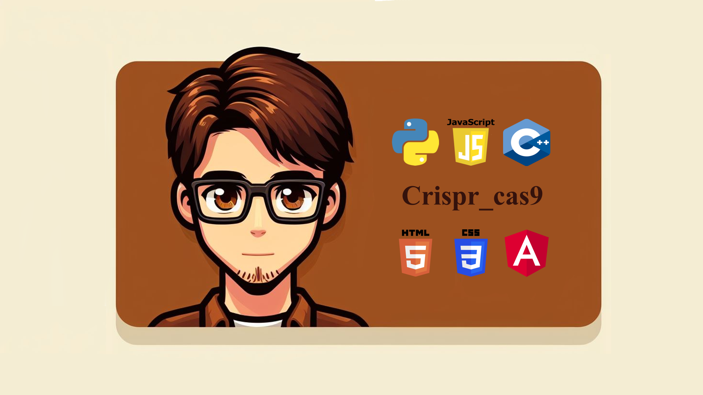

  <h1 align="center"> Hola a todos, Yo soy Cristian muñoz 👋 </h1>

  <h1 display="inline-block">
    tengo conocimientos de
  </h1>
 https://readme-typing-svg.demolab.com?font=Fira+Code&weight=700&size=26&pause=1000&color=E7D9A1&random=false&width=435&lines=Python;JavaScript;C%2B%2B;PHP;SQL;Arduino)](https://git.io/typing-svg

  
  
  
  

<!--
**Crispr-cass9/Crispr-cass9** is a ✨ _special_ ✨ repository because its `README.md` (this file) appears on your GitHub profile.

Here are some ideas to get you started:

- 🔭 I’m currently working on ...
- 🌱 I’m currently learning ...
- 👯 I’m looking to collaborate on ...
- 🤔 I’m looking for help with ...
- 💬 Ask me about ...
- 📫 How to reach me: ...
- 😄 Pronouns: ...
- ⚡ Fun fact: ...
-->
